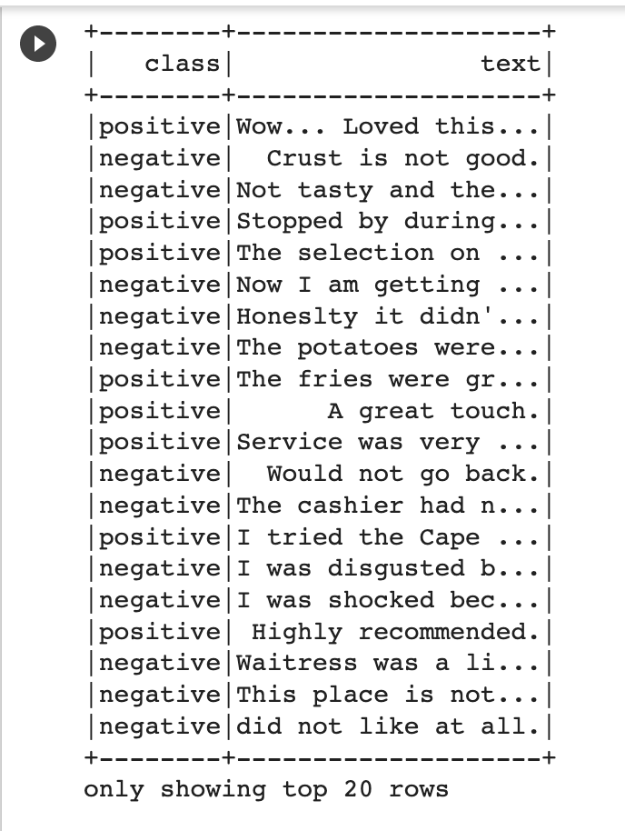
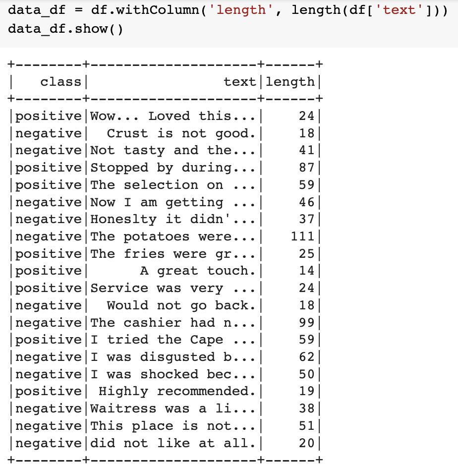
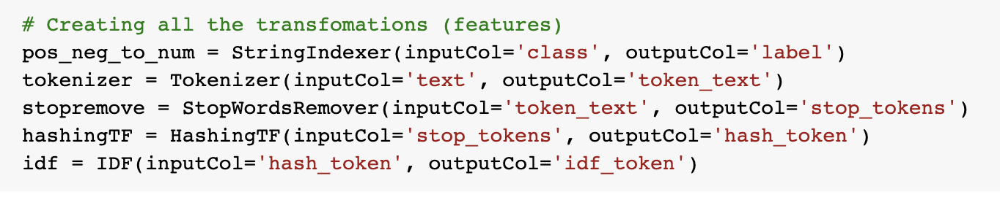
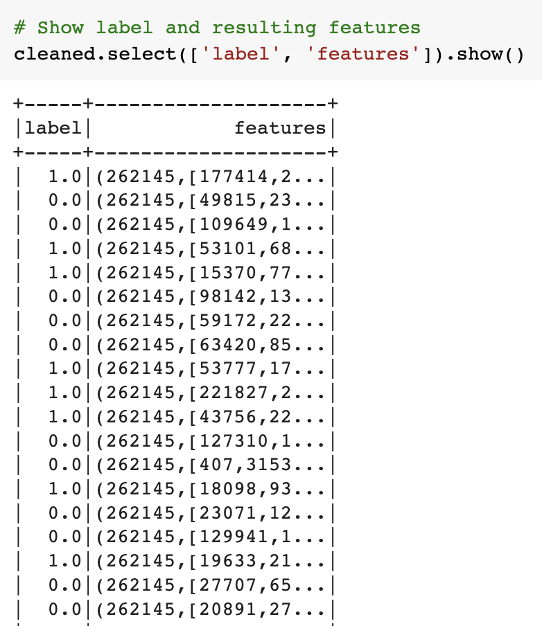
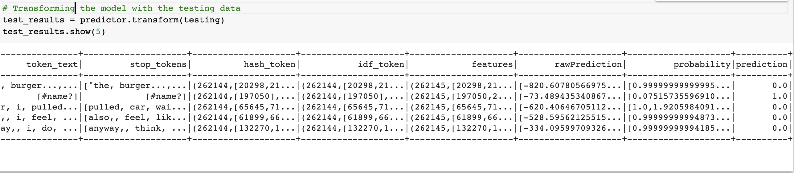
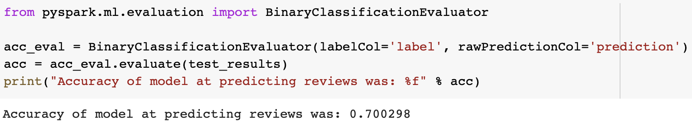

# NLP-with-Yelp-Reviews
Using Natural Language Processing to parse Yelp review data and testing a Machine Learning Model's ability to predict positive or negative reviews

## Resources
  * Python
  * Pyspark
  * Google CoLab

## Method

The Yelp review data was composed of 1000 yelp reviews for a restaurant csv format. Each review included the text of the review as well as a classification of 'positive' or 'negative'. 

#### Initial Data 

#### Adding a 'length' as a feature for later prediction modeling

#### Transformation code

#### Labels and resulting features DataFrame

#### Transformed Model DataFrame
The data was split into 70% training data and 30% testing data.  Then a Naive Bayes Machine Learning classifier model was fit to the training data. The fit model was then used to produce predicted classification on the testing Yelp reviews. Predicted values are seen in the last column of the DataFrame.

#### Model Accuracy

## Analysis
At 70% accuracy there is room for improvement. However, if the goal is simply to get a high level assessment of general sentiment then this model may be helpful with further sets of yelp reviews on this particular restaurant.
